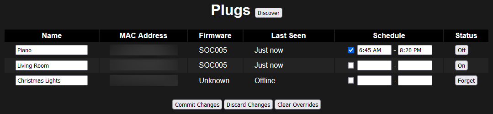

OrviboConsole
=======================================================================================================================

This project is a small Blazor webapp I use for controlling my Orvibo S20 smart plugs. It also features a terminal UI app and an interactive command line wizard used to pair new sockets to your WiFi network.

Both frontends allow toggling the power state of arbitrary plugs. The Blazor webapp also supports toggling the power state on a schedule (as well as allowing you to override said schedule temporarily.)

The project originally started life as a .NET Framework 4.5 WinForms app in late 2015 to control my Christmas lights (I was too cool for mechanical timers apparently.) In 2021 I rewrote the whole thing as a .NET 6 Blazor Server app so that I could control the plugs from my phone.

Note that the Orvibo S20 smart plugs are sadly no longer manufactured (and haven't been for quite some time.) I originally chose to use them back in 2015 specifically because they were known to be easy to interface with and as a result could be used without any cloud nonsense.

This project would not have been possible if not for the reverse engineering efforts of [Andrius Štikonas](https://stikonas.eu/wordpress/2015/02/24/reverse-engineering-orvibo-s20-socket/) and [Nozza87](https://pastebin.com/LfUhsbcS).

   Screenshot of the Blazor app

## License

This project is licensed under the MIT License. [See the license file for details](LICENSE.txt).

This project has no third-party dependencies beyond the .NET SDK.

## Building

In order to build the project you will need to install the [.NET 6 SDK](https://dotnet.microsoft.com/en-us/download).

Building it is like any other .NET project. Open Visual Studio, select a startup project, and press F5 to run. Alternatively, execute `dotnet run --project OrviboBlazor` in the root of the repo.

## Project Overview

This app was never really meant to see the light of day, I'm mostly archiving it on GitHub for posterity. I've been using it for nearly eight years now so it's certainly reliable (more reliable than the plugs themselves actually), but beware of jank.

* `OrviboBlazor` -- As the name suggests this is the main Blazor webapp. It also contains the plug schedule infrastructure.
* `OrviboConfigurationTool` -- Interactive console app for configuring Orvibo plugs to use your WiFi network.
* `OrviboConsoleApp` -- A simple terminal UI for discovering and toggling plugs. (Intended for testing `OrviboControl` outside of Blazor.)
* `OrviboControl` -- Common functionality for enumerating and interacting with smart plugs.
